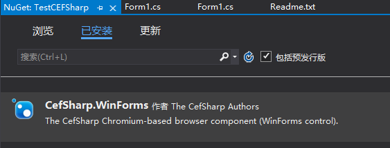
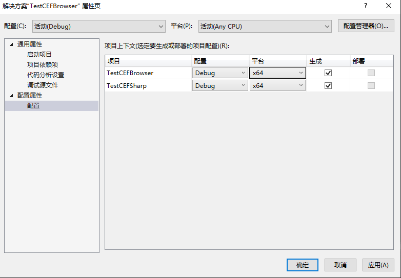
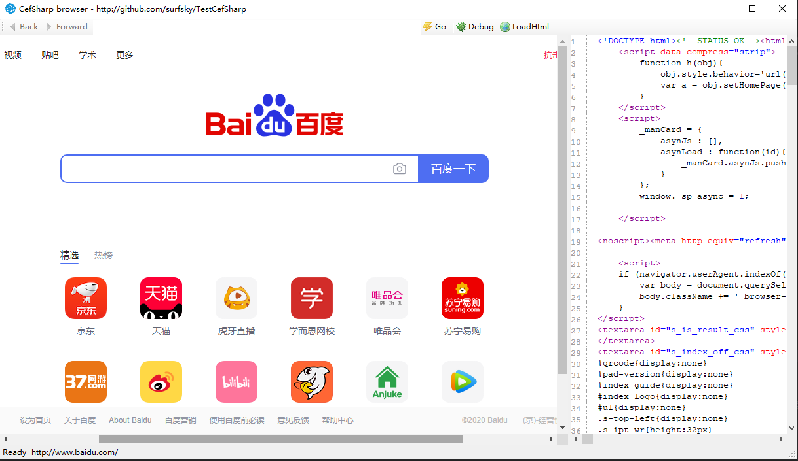
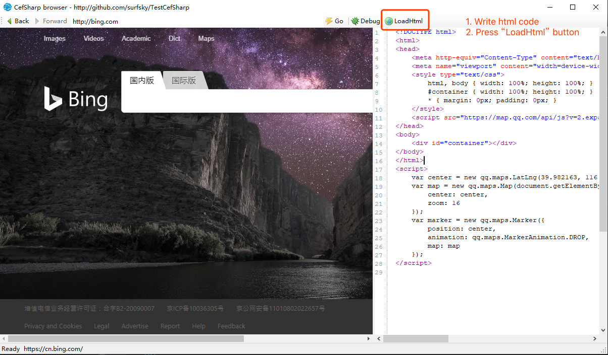
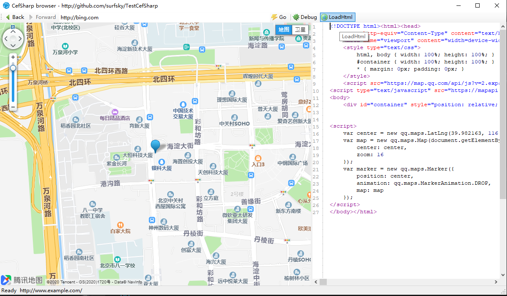
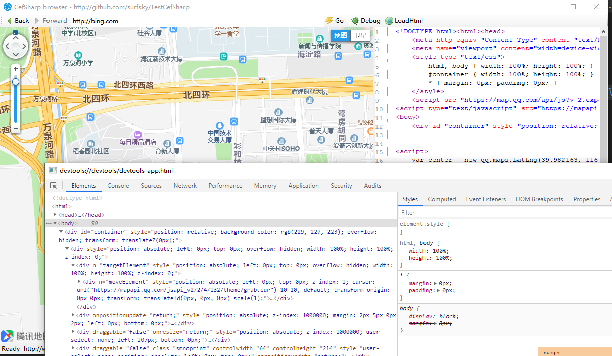

# TestCefSharp

CefSharp web browser demo. http://github.com/surfsky/TestCefSharp
Cef is Chromium Embedded Framework.
CefSharp is a CEF dotnet wrapper. See:

- https://github.com/cefsharp/CefSharp
- http://cefsharp.github.io
- https://github.com/cefsharp/CefSharp.MinimalExample
- https://github.com/sharpbrowser/SharpBrowser
- https://github.com/cefnet/cefnet

# Features

- [x] Display web
- [x] Back & Forward button
- [x] Develop tool
- [x] Show html
- [x] Load html
- [ ] Invoke Js function : https://www.cnblogs.com/jsydb/p/9993516.html
- [ ] Invoke C# method: https://www.cnblogs.com/jsydb/p/9993516.html
- [ ] Use tab to show "_blank" link page: 

# Basic steps to use CefSharp browser control

1. Create windows form project with netframework over **4.5.2**.
2. install CefSharp.WinForms with nuget.

    

3. Set project build platform to x64

    

4. Write codes

    ``` csharp
    using CefSharp;
    using CefSharp.WinForms;

    public partial class Form1 : Form
    {
        protected ChromiumWebBrowser browser;

        public Form1()
        {
            InitializeComponent();
            InitBrowser();
        }

        public void InitBrowser()
        {
            Cef.Initialize(new CefSettings());
            browser = new ChromiumWebBrowser("http://www.baidu.com");
            browser.Font = new Font("Arial", 10.5f);
            browser.Dock = DockStyle.Fill;
            browser.LoadingStateChanged += Browser_LoadingStateChanged;
            this.Controls.Add(browser);
        }

        private void Browser_LoadingStateChanged(object sender, LoadingStateChangedEventArgs e)
        {
            this.lblStatus.Text = e.IsLoading ? "Loading" : "Ready";
        }
    }
    ```

5. Run it.

    
    
    
    


```csharp

call js 

    c#
        browser.ExecuteScriptAsync("document.body.style.background = 'red';");
        browser.ExecuteJavaScriptAsync("(function(){ document.getElementsByName('q')[0].value = 'CefSharp Was Here!'; document.getElementsByName('btnK')[0].click(); })();");
        JavascriptResponse response = await browser.EvaluateScriptAsync(script);
        browser.GetBrowser().GetFrame("SubFrame").ExecuteJavaScriptAsync("document.body.style.background = 'red';");


call host

    js
        CefSharp.PostMessage(window.getSelection().toString());

    c#
        private void OnBrowserJavascriptMessageReceived(object sender, JavascriptMessageReceivedEventArgs e)
        {
	        var windowSelection = (string)e.Message;
	        //DO SOMETHING WITH THIS MESSAGE
	        //This event is called on the threads pool, to access your UI thread
                //You can cast sender to ChromiumWebBrowser
	        //use Control.BeginInvoke/Dispatcher.BeginInvoke
        }

```