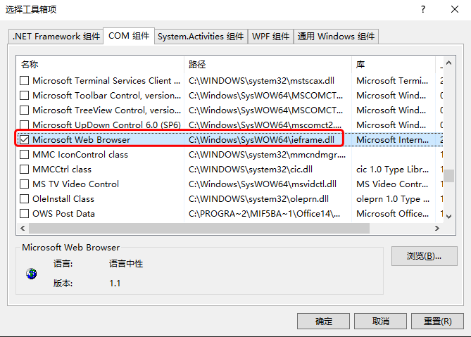
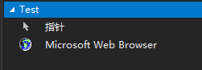
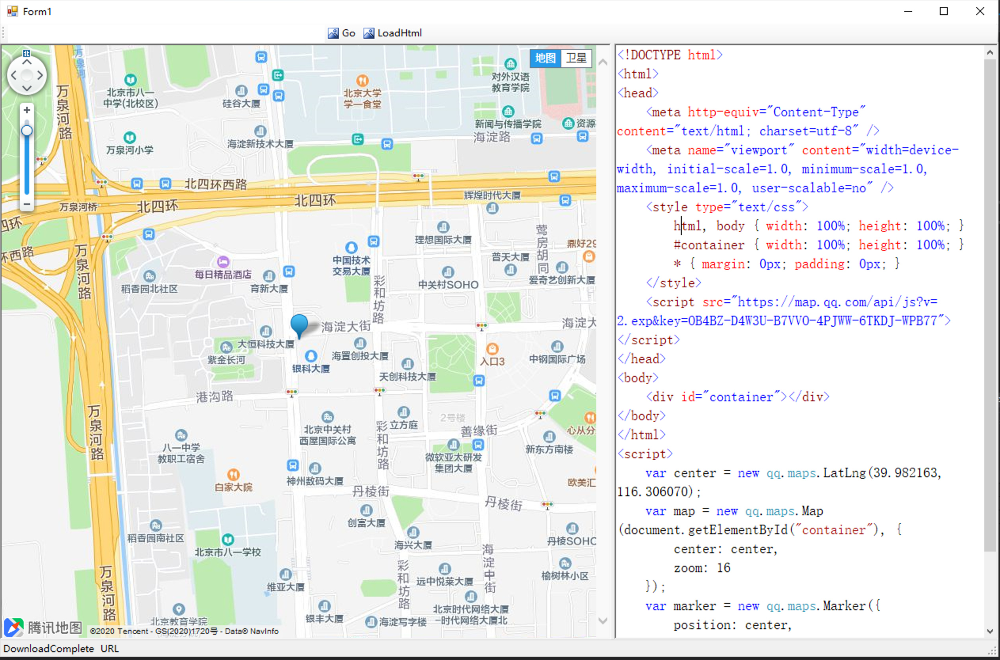

# Microsoft Web Browser COM control demo


https://github.com/surfsky/WinFormWebViews/TestInternetControl

# Steps

1. Add Microsoft Web Browser to controls panel
   
   
   > ps. The old name is **Microsoft Internet Controls**

2. Drag this control into form.

3. Write codes.

```cs
// ignore js error
this.webBrowser.Silent = true;

// navigate to some url
var url = this.tbUrl.Text;
this.webBrowser.Navigate(url);

// load html
var html = this.tbHtml.Text;
var path = string.Format("{0}\\tmp.html", Environment.CurrentDirectory);
Common.WriteNewFile(path, html);
this.webBrowser.Navigate(path);
```

3. Run


