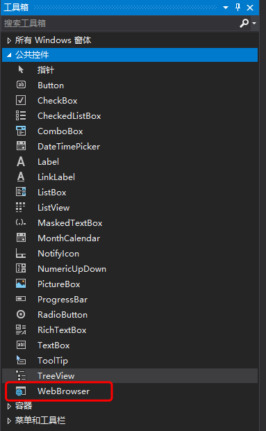

# Microsoft WebView demo


https://github.com/surfsky/WinFormWebViews/

# Steps

1. Nuget install Microsoft.Tookit.Forms.UI.Controls.WebView.
2. Drag webview control into form.


2. Write codes.

```csharp

// navigate to some url
this.webview.Navigate(this.tbUrl.Text);

// load html2
var html = this.tbHtml.Text;
var path = string.Format("{0}\\tmp.html", Environment.CurrentDirectory);
CreateFile(path, html);
this.webview.Navigate(path);  // ok
```

3. Run


# Tips

- 该方案支持 Edge 和 IE；
- 该方案已被放弃，请使用最新的 WebView2(WebViews)[https://docs.microsoft.com/zh-cn/microsoft-edge/webview2/get-started/winforms]