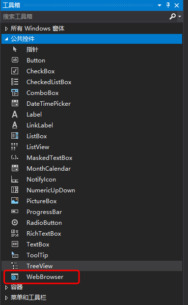

# Microsoft WebView2 demo


https://github.com/surfsky/WinFormWebViews/

# Steps

1. Nuget install Microsoft.Web.WebView2.
2. Drag webview2 control into form.


2. Write codes.

```csharp

// navigate to some url
this.webView.Source = new Uri("baidu.com");
this.webView.CoreWebView2.Navigate(this.tbUrl.Text);

// load html2
var html = this.tbHtml.Text;
var path = string.Format("{0}\\tmp.html", Environment.CurrentDirectory);
CreateFile(path, html);
this.webView.CoreWebView2.Navigate(path);  // ok
```

3. Run


# Tips

- 该方案支持 Edge 和 IE；
- 该方案是最新支持的（2021-11）[https://docs.microsoft.com/zh-cn/microsoft-edge/webview2/get-started/winforms]


``` cs
初始化
    方法一：
        webView.Source = new Uri("https://baidu.com");
    方法二：
        webView.CoreWebView2InitializationCompleted += WebView_CoreWebView2InitializationCompleted;
        webView.EnsureCoreWebView2Async();


JS调用宿主方法
   方法一：Message
        webView.WebMessageReceived += WebView_WebMessageReceived;
        // js 回调时会触发该方法
        private void WebView_WebMessageReceived(object sender, Microsoft.Web.WebView2.Core.CoreWebView2WebMessageReceivedEventArgs e)
        {
            var cmd = e.WebMessageAsJson.Trim('"');
            var p = cmd.SplitString();
            ShowLngLat(p[1], p[2], p[3], p[4]);
        }
        /// <summary>显示经纬度。</summary>
        public void ShowLngLat(string lng1, string lat1, string lng2, string lat2)
        {
            this.tbPointTL.Text = string.Format("{0}, {1}", lng1, lat1);
            this.tbPointBR.Text = string.Format("{0}, {1}", lng2, lat2);
        }

   方法二：注册HostObject，映射类方法
        webView.CoreWebView2.AddHostObjectToScript("bridge", new JavaScriptBridge());
        webView.CoreWebView2.AddScriptToExecuteOnDocumentCreatedAsync("var bridge = chrome.webview.hostObjects.bridge;");
        /// <summary>
        /// 该类暴露给 Js 进行调用
        /// </summary>
        [ComVisible(true)]
        public class JavaScriptBridge
        {
            /// <summary>
            /// const bridge = chrome.webview.hostObjects.bridge;
            /// var info = await bridge.func("world");
            /// </summary>
            /// <param name="p"></param>
            /// <returns></returns>
            public string func(string p)
            {
                return "hello " + p;
            }
        }

宿主程序调用JS
    方法一：直接执行
            webView.CoreWebView2.ExecuteScriptAsync("alert('webview2 is ready!')");
    方法二：消息方式

```