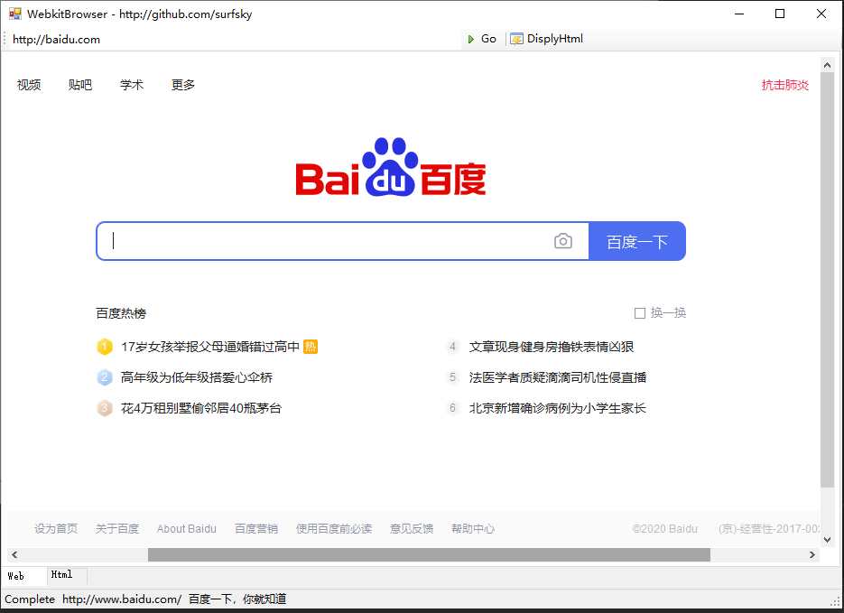
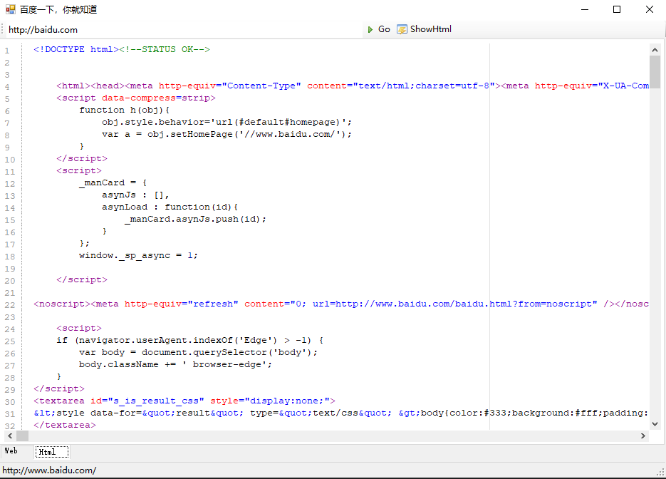
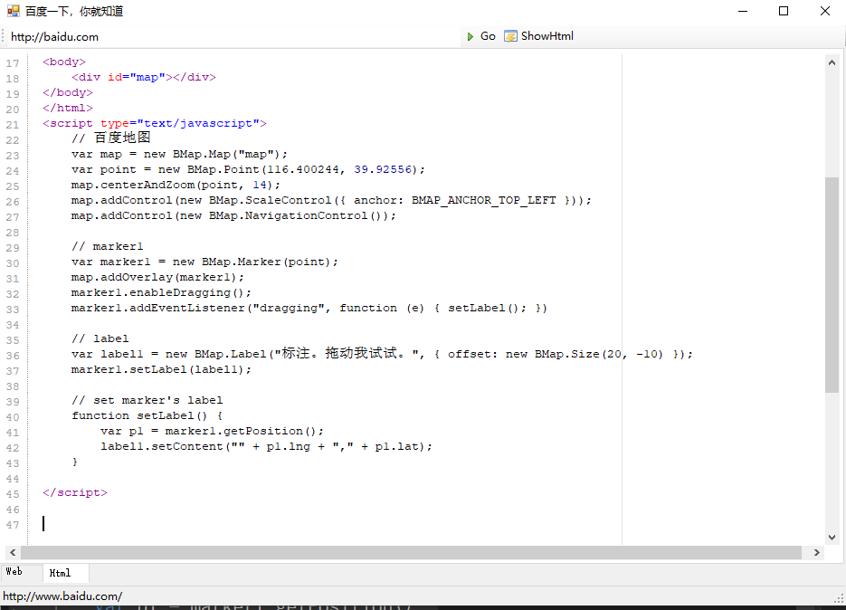
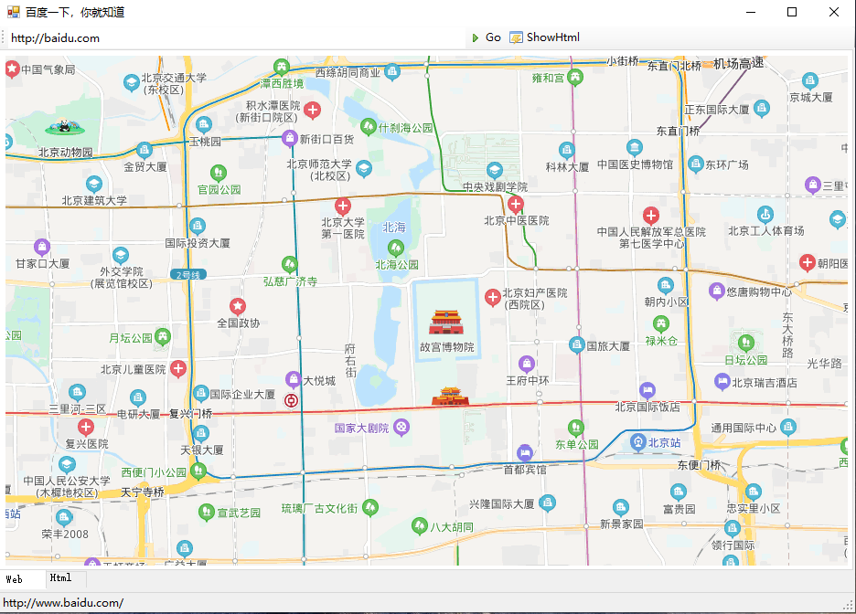

# WebkitBrowser Demo
Webkit web browser demo for windows form

https://github.com/surfsky/WinFormWebViews/TestWebkitBrowser

# Features

- [x] Show web.
- [x] Show web code with highlight syntax.
- [x] Write html, and display to web.
- [ ] Click hyperlink and jump.

# Snaps

# Remark

功能不完善，也慢.
建议迁移到 CefSharp.
腾讯地图无法展示

