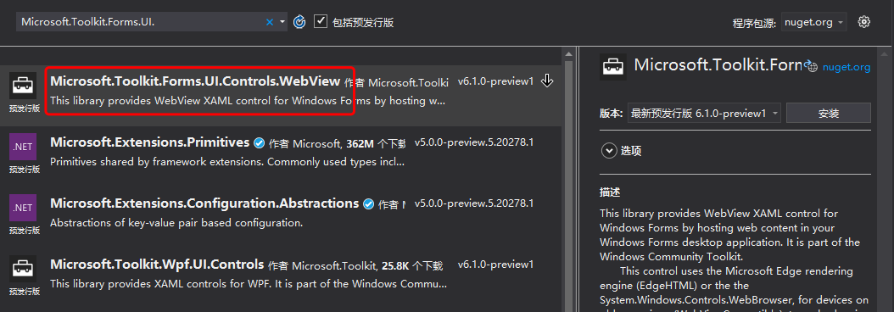
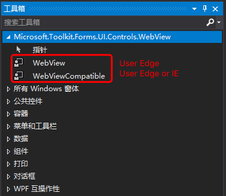
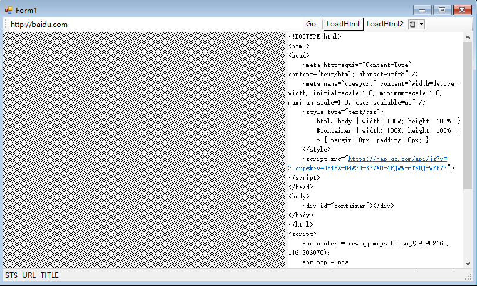

# XAML Island WebView Demo


https://github.com/surfsky/WebViewSolutions/TestXamlIsland

# Steps

1. Install nuget package: Microsoft.Toolkit.Forms.UI.Controls.WebView
    

2. Drag WebView/WebViewCompatible control into form.
   
   

3. Write codes.

    ```csharp
    // navigate to some url
    this.webView.Navigate(this.tbUrl.Text);

    // load html
    var html = this.tbHtml.Text;
    this.webView.NavigateToString(html); // may not show

    // load html2
    var html = this.tbHtml.Text;
    var path = string.Format("{0}\\tmp.html", Environment.CurrentDirectory);
    Common.WriteNewFile(path, html);
    this.webBrowser.Navigate(path);  // throw exception
    ```

3. Run

    


4. Remark

- Xaml Island 的引入，让 windows form 有更多的可能性。
- 结合 winform 的便捷性和 Xaml 的灵活性。
- Xaml WebView 有点问题，不知道怎么展示本地的网页。